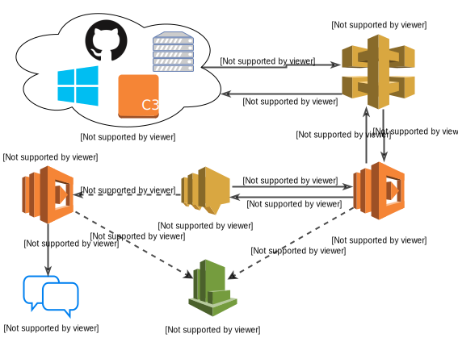

Overview
========

This diagram may look like there is a lot going on but there really isn't much
to it.

Here's the gist of it:

#. Internet service X performs a POST request on the IRC Hooky endpoint

#. API Gateway receives this request and triggers the IRC Hooky Lambda function

#. IRC Hooky Lambda function validates the payload, drops a message into an SNS
   topic, and returns a 200 (this 200 propagates back to the caller)

#. Asynchronously, that SNS message triggers another version of the IRC Hooky
   Lambda function. This version takes care of making the outbound connection
   to the IRC server and sending the notification message.

Asynchronous IRC Connection
---------------------------

There is currently a hard `10-second`__ limit on all requests triggered via API
Gateway. The problem that this poses is that establishing an IRC connection
(joining the channel, etc) unfortunately takes longer than 10 seconds, which
results in API Gateway returning a 504 back to the (webhook) caller.

__ http://docs.aws.amazon.com/apigateway/latest/developerguide/limits.html

This is not ideal because from the caller's point-of-view, the webhook failed,
which might warrant a retry even though the (triggered) Lambda function happily
continued executing.

The asynchronous IRC connection is a nice compromise between returning back to
the caller in a timely manner (under a second), and attending to a long running
task.

One nice side-effect of using this design is that AWS will retry__ any failed
(asynchronous) Lambda invocations, which means this system could potentially
survive brief network outages (if tweaked to do so).

__ http://docs.aws.amazon.com/sns/latest/dg/DeliveryPolicies.html
